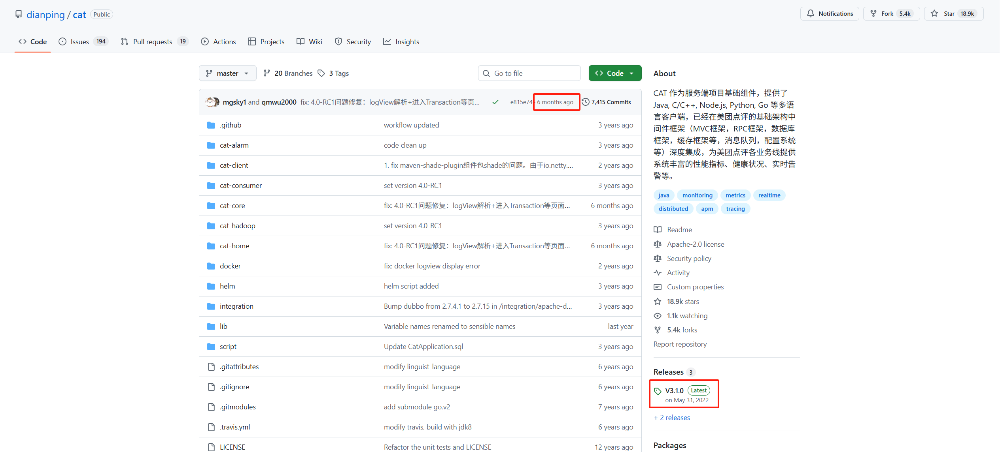

?> CAT 作为服务端项目基础组件，提供了 Java, C/C++, Node.js, Python, Go
等多语言客户端，已经在美团点评的基础架构中间件框架（MVC框架，RPC框架，数据库框架，缓存框架等，消息队列，配置系统等）深度集成，为美团点评各业务线提供系统丰富的性能指标、健康状况、实时告警等。

截止目前，官网显示稳定版本为 2022 年的 v3.1.0，最新的 v4.0-RC1 处于发布候选状态，而且是六个月前有更新。我们基于最新的源码来部署服务端和客户端。

{docsify-updated}