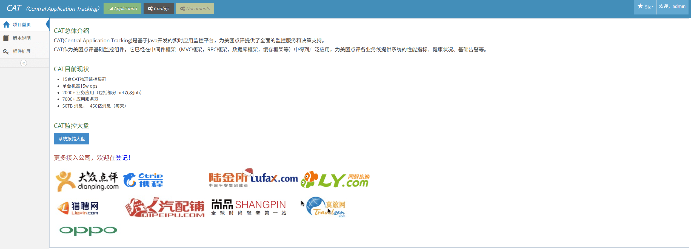

服务端部署完成后，可以直接访问管理后台 /cat，默认账号密码为 admin admin，密码可以在服务端环境变量配置。


点击上方的 Application 发现报错，我们需要先点击 Configs 进行一些配置。切换到左侧的全局系统配置：

1. 点击服务端配置，主要是修改服务端地址的 127.0.0.1 改为 K8s 服务名：cat-home-service，其他根据需求个性化配置：

```xml

<property name="remote-servers" value="cat-home-service:8080"/>
```

?> 注意：服务端配置中，告警机和任务机只需要配置到一个实例上，如果是多副本部署，可以创建一个 Service 指定其中一个
pod，在服务端配置中指定这个 Service 名。

2. 点击客户端路由，将其中的 127.0.0.1 改为 K8s 服务名：cat-home-service

3. 切换到左侧的项目配置信息，添加好项目名，之后就可以进行客户端接入

!> 注意：如果页面无法访问，或者配置提交提示操作失败，检查 Cat 启动日志是否有报错，如数据库连接失败等问题。

{docsify-updated}