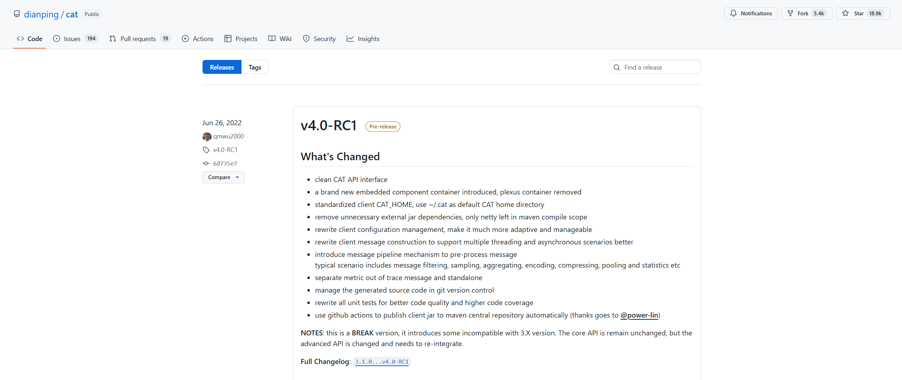

参考自官网发布内容：

目前最新的 v4.0-RC1 相比 v3.1.0 的更新内容大致如下：

1. 干净的 CAT API 接口
2. 引入全新的嵌入式组件容器，移除 Plexus 容器
3. 标准化客户端CAT_HOME，使用 ~/.cat 作为默认 CAT 主目录
4. 删除不必要的外部 jar 依赖项，Maven 编译范围内只剩下 netty
5. 重写客户端配置管理，使其更具适应性和可管理性
6. 重写客户端消息构造，更好地支持多线程和异步场景
7. 引入消息流水线机制对消息
8. 进行预处理典型场景包括消息过滤、采样、聚合、编码、压缩、池化和统计等
9. 将指标分开，跟踪外消息和独立
10. 支持 MySQL 8 版本

## 主要模块

- cat-client: 客户端，上报监控数据
- cat-consumer: 服务端，收集监控数据进行统计分析，构建丰富的统计报表
- cat-alarm: 实时告警，提供报表指标的监控告警
- cat-hadoop： 数据存储，logview 存储至 Hdfs
- cat-home: 管理端，报表展示、配置管理等

{docsify-updated}